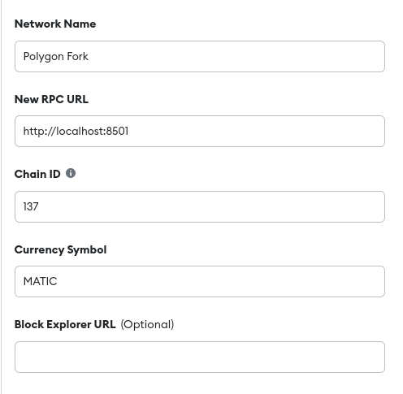

## Running the whole system in local

After you have `make up` the project, you have all the non-blockchain elements of the system running on
your local machine. If you now also want to execute transactions on local environment, in order to test
some functionalities or screens only available when executing transactions, or because you are developing
some Solidity functionality that you need to test "live", you are going to make some extra steps.

Basically, what you are going to need is:
- Install Metamask on a browser where you didn't have it before
- Create a new mnemonic on this Metamask wallet
- Add the new mnemonic on your local `.env`
- Add a new network in this Metamask
- Fork the chain

Just then you will be able to execute transactions on the local environment, and they will be executed
on the forked local blockchain.

But, the steps above will only be enough if you want to use the currently deployed version of the contracts
for your execution. If you want to try you new Solidity code on local environment, there's a couple more steps
that you'll have to do.

- Compile the contracts once you are happy with them
- Deploy/update the contract that you are working on the forked local chain

Now I'll go in details on each of all these steps.

### Install Metamask on a new browser
The reason why you cannot use your existing Metamask on your existing browser, it's because most probably
you already have the network IDs that we are going to add, and you cannot have two networks with the
same ID on Metamask. It also helps to compartmentalize, this way you always know when you are executing
a transaction on the local environment or on the real one, so it helps to prevent mistakes.

### Create a new mnemonic
When installing Metamask you can choose to create a new one or add an existing one, really the decision is
yours. There is no leaks, no executions on mainnet or anything else, but it just makes sense to have a
completely different account for all the testing purposes. This mnemonic will be only yours, but you will
have to add it to your local `.env` so Ganache can send you coins when forking the network on your local machine.

### Add the new mnemonic to your local `.env`
On the root of the repository, if you don't have it already, create a file `.env`.

There, you have to add a line like this:
```shell
MNEMONIC=put your flashy newly created mnemonic here but at no other place
```

### Add a new network in this Metamask
Now you need to add a network. You can add any of the accepted networks, listed in
[this env file](https://github.com/SwidgeTeam/swidge/blob/master/env/default/networks.env).
But for the example let's say we add Polygon.

According to the details on the given env file, it will be:
```
chainId: 137
port: 8501
```

The network that you decide to include here, it's the one that we will fork later, and it's the one that
you will have to use as the origin chain on your transaction from the app.

Now you can go to our clean Metamask > Settings > Networks > Add/Create

By the end you should have a form that looks similar to this:

<div style="text-align: center;">



</div>

Save, and you are good to go. If you select you `Polygon Fork` network on Metamask it should keep loading,
trying to connect to an RPC node that is not yet up.

### Fork the chain
Now you only need to execute one command to fork the selected chain. Since we added Polygon, the command will be

```shell
make fork-polygon
```

That will take a bit the first time, but soon you should see how Ganache spins the fork.

At this point you can already go to your new Metamask and select `Polygon Fork`, it will show your account
with plenty of freshly minted MATIC to spend on transactions.

If you open the app with this browser, you will be able to execute transactions against your local blockchain,
with your fake local coins.

Then only downside tho, is, don't expect the swap to finalize. For that you would need to spin up both forked
chains, and bring the relayer up too. That's for another document.

## Extra steps

Now, if you still reading it's because you want to test new Solidity code on your local machine.

### Compile the contracts
You always need to compile the contracts before deploying, because the contracts deployed are the compiled ones.

To compile, execute:
```shell
make build-contracts
```

### Update/deploy the contract facet

Now you will update/deploy the diamond facets that you are working on into the diamond.

I am assuming for simplicity's sake that you are not deploying a new diamond on you local machine, if it's 
the case, you either know what to do already or ask advice someone on the team.

There's a couple of ways you can update a facet:

- Update all the contracts on the diamond

```shell
make udf-polygon # or any other chain you spun up
# acronym of Update Diamond Fork
```

- Updating the one you want
```shell
make deploy-facet-fork-polygon facet="NameOfTheFacetContract"
```

After that, if the deploy occurs successfully, you can test it by executing a transaction from the app.

Needless to say that it's faster and better to test contracts with unit testing, but there's some occasions 
that you might want to test yourself the whole system integration.